# Geopolítica y Precio del Crudo: ¿Puede GDELT anticipar días de estrés en el mercado?

> **Pregunta central:** ¿Puede la actividad noticiosa registrada por GDELT en zonas geoestrategicas del crudo anticipar, con un dia de adelanto, dias de estrés en el mercado del petróleo?

---

## Contexto y motivación

El precio del crudo es uno de los activos financieros más sensibles a la geopolítica del planeta. Las guerras, sanciones, decisiones de la OPEP o bloqueos en chokepoints como el estrecho de Ormuz generan shocks que el mercado absorbe de forma rápida pero no siempre eficiente. La pregunta que se plantea este proyecto no es si la geopolítica mueve el crudo —eso ya está ampliamente documentado—, sino si existe una **señal anticipatoria** en el flujo de noticias que pueda identificarse con un día de antelación antes de que el mercado la descuente.

Para responderla se construye un sistema de predicción completo que combina cuatro fuentes de datos heterogéneas: el mercado financiero del crudo, el índice de riesgo geopolítico de Caldara & Iacoviello, los datos macroeconómicos globales (VIX y DXY) y el corpus GDELT, una base de datos que indexa en tiempo casi-real la cobertura mediática mundial de eventos políticos y de conflicto.

El proyecto sigue una metodología rigurosa de validación temporal, sin contaminación entre train y test, y pasa por nueve etapas documentadas: desde la limpieza de datos hasta el análisis de robustez e interpretabilidad.

---

## Índice

1. [Fuentes de datos](#1-fuentes-de-datos)
2. [Estructura del proyecto](#2-estructura-del-proyecto)
3. [Análisis exploratorio](#3-análisis-exploratorio-nb03)
4. [Feature Engineering](#4-feature-engineering-nb04)
5. [Event Study](#5-event-study-nb05)
6. [Modelos Baseline](#6-modelos-baseline-nb06)
7. [Clasificación ML](#7-clasificación-ml-nb07)
8. [Regresión ML](#8-regresión-ml-nb08)
9. [Interpretabilidad y Robustez](#9-interpretabilidad-y-robustez-nb09)
10. [Veredicto final](#10-veredicto-final)

---

## 1. Fuentes de datos

### 1.1 WTI Crude Oil (precio y opciones)

- **Fuente:** Yahoo Finance / FRED (Federal Reserve Economic Data)
- **Variables:** precio de cierre WTI USA, precio WTI Europa (Brent proxy), spread WTI-Brent, OVX (CBOE Crude Oil Volatility Index)
- **Periodo:** 1986–2026 (histórico); 2010–2026 (dataset ML)
- **Por qué:** El WTI es el benchmark del crudo americano. El OVX es la volatilidad implícita de las opciones sobre crudo y actúa como termómetro de la expectativa de riesgo del mercado.

### 1.2 GDELT (Global Database of Events, Language, and Tone)

- **Fuente:** GDELT Project (gdeltproject.org) — extracción por zonas geoestrategicas
- **Variables:** `event_count_total`, `mentions_total`, `avg_tone_daily`, `goldstein_mean`, `goldstein_min`, `extreme_event_dummy`, conteos por región (Golfo Pérsico, Rusia/FSU, chokepoints, África, Américas) y por tipo de evento CAMEO (conflicto, fuerza militar, amenaza, acuerdo, diplomático)
- **Periodo:** 2015-01-05 – 2026-03 (limitación de extracción; 2010-2014 se imputa como 0)
- **Por qué:** GDELT indexa noticias de más de 100 medios en tiempo casi-real y codifica cada evento con la escala Goldstein (grado de conflictividad, de −10 a +10) y el tono medio de la cobertura. Es la única fuente pública de actividad noticiosa codificada a nivel de evento con cobertura global.
- **Limitación documentada:** El volumen de eventos cae aproximadamente un 70% a partir de 2020, probablemente por cambios en la infraestructura de extracción. Las features de cambio y rolling mitigan parcialmente este sesgo.

### 1.3 GPR — Geopolitical Risk Index (Caldara & Iacoviello, 2022)

- **Fuente:** Matteo Iacoviello (Federal Reserve Board) — datos públicos en su web personal
- **Variables:** `gpr` (índice de riesgo geopolítico total), `gpr_act` (riesgo geopolítico realizado), `gpr_threat` (amenaza percibida)
- **Periodo:** 1985–2026
- **Por qué:** A diferencia de GDELT, el GPR es un índice curado que mide la percepción de amenaza geopolítica a través de búsquedas en medios anglosajones de referencia (NYT, WSJ, FT...). Captura el riesgo geopolítico estructural que el mercado ya ha comenzado a descontar, mientras GDELT captura el volumen bruto de eventos.

### 1.4 VIX y DXY

- **Fuente:** Yahoo Finance
- **Variables:** `vix_close` (CBOE Volatility Index — S&P500), `dxy_close` (US Dollar Index)
- **Periodo:** 2010–2026
- **Por qué:** El VIX captura el riesgo sistémico global (panic index) y el DXY el valor del dólar. Ambos son variables de contexto macroeconómico esenciales: el crudo se denomina en dólares y está correlacionado negativamente con el DXY, y los episodios de risk-off global (VIX alto) suelen coincidir con shocks en materias primas.

---

## 2. Estructura del proyecto

```
.
├── 01_data_cleaning.ipynb          # Limpieza y validación de fuentes raw
├── 02_master_dataset.ipynb         # Construcción del dataset ML y targets
├── 03_eda.ipynb                    # Análisis exploratorio completo
├── 04_feature_engineering.ipynb    # Construcción de 67 features con anti-leakage
├── 05_event_study.ipynb            # Event study clásico (metodología MacKinlay)
├── 06_baseline.ipynb               # Modelos de referencia
├── 07_classification.ipynb         # Clasificación ML (LogReg / RF / XGBoost)
├── 08_regression.ipynb             # Regresión ML (Ridge / RF / XGBoost)
├── 09_interpretability_robustness.ipynb   # SHAP, ablation, robustez, error analysis
├── geopolitica_crudo_completo.ipynb       # Notebook unificado (todos los anteriores)
├── outputs/                        # Figuras, parquets y CSVs de resultados
│   ├── ml_dataset.parquet          # Dataset base (4,059 días × 37 cols)
│   ├── train_engineered.parquet    # Train con 67 features (2010-2020, 2,678 días)
│   ├── test_engineered.parquet     # Test con 67 features (2021-2026, 1,179 días)
│   ├── feature_list.csv            # Listado de features con grupo
│   └── fig_*.png                   # Todas las figuras generadas
└── geopolitical_events_timeline.csv   # 35 eventos geopolíticos 2010-2026
```

**Partición temporal (sin shuffling, sin filtración):**

| Split | Periodo | Días |
|---|---|---|
| Train | 2010-01-20 – 2020-12-31 | 2,678 |
| Test | 2021-01-04 – 2026-03-12 | 1,179 |

---

## 3. Análisis exploratorio (NB03)

### 3.1 Auditoría de cobertura temporal

Antes de cualquier análisis se documentó la cobertura de cada fuente. El hallazgo más relevante: GDELT comienza el 5 de enero de 2015, lo que implica un gap de cinco años de mercado sin cobertura mediática geoestratégica. En el feature engineering se optó por imputar estos años con 0 (tono neutro, 0 eventos) para preservar el periodo de entrenamiento sin artificios de leakage.

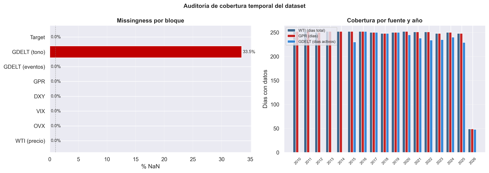

### 3.2 El mercado del crudo: distribuciones y fat tails

El log-return diario del WTI tiene kurtosis excess de aproximadamente 12 (normal = 0), confirmando la presencia de fat tails severos. El test de D'Agostino-Pearson rechaza normalidad con p < 10⁻¹⁰⁰. En abril de 2020 el WTI tocó −37 USD/barril por la crisis de los futuros.

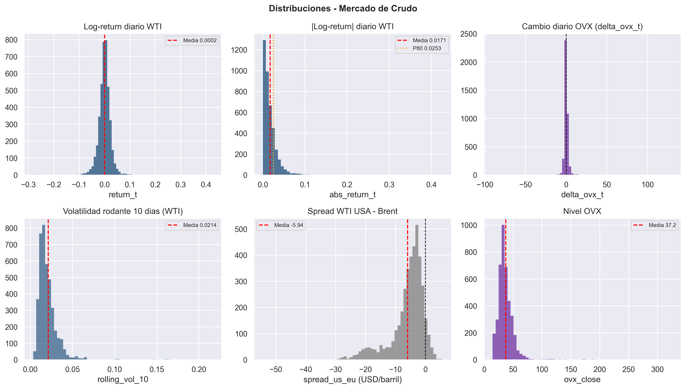

### 3.3 Riesgo sistémico: VIX y DXY

El VIX supera el umbral de 30 (estrés grave) en aproximadamente el 15% de los días del dataset. La correlación negativa entre delta_DXY y return_WTI (dólar fuerte = crudo presionado) es consistente y estadísticamente robusta.

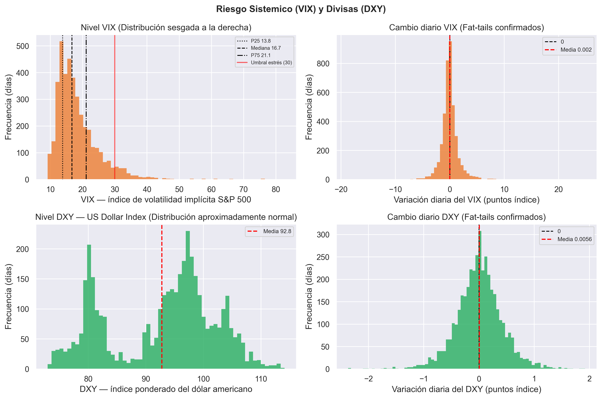

### 3.4 Autocorrelación y clustering de volatilidad

Los retornos no muestran autocorrelación significativa (mercado eficiente), pero los retornos absolutos sí tienen persistencia elevada en los primeros 10-15 lags, confirmando el GARCH-effect clásico. Esto justifica el uso de volatilidades rolling como features.

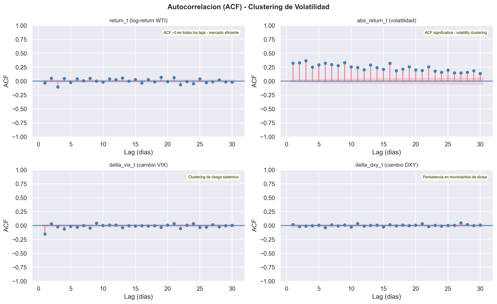

### 3.5 Target: días de estrés

El target binario `high_stress_day` se define como la unión de dos condiciones P80 calculadas exclusivamente en train: `abs_return_t1 > 0.0247` o `delta_ovx_t1 > 1.042`. El resultado es un target con prevalencia del ~30–38%, desequilibrado pero manejable.

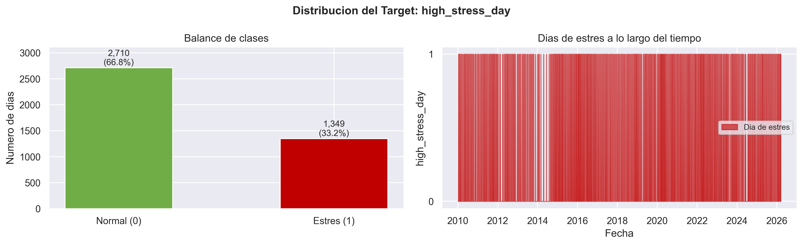

### 3.6 Comparativa: días normales vs días de estrés

Los violin plots con test Mann-Whitney U confirman que OVX, VIX y DXY son significativamente distintos entre días de estrés y días normales (p < 0.001 en todos ellos). La actividad GDELT muestra diferencias estadísticamente significativas pero con menor magnitud, lo que anticipa su papel como señal complementaria, no dominante.

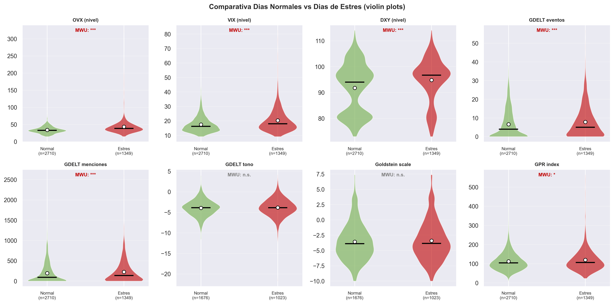

### 3.7 Sesgos temporales del GDELT

La caída del volumen de eventos GDELT a partir de 2020 es visible e importante. No se debe interpretar como menos tensión geopolítica, sino como un artefacto de extracción. Las features de cambio (`diff`) y rolling mitigan este sesgo, pero es un factor de incertidumbre que se documenta explícitamente.

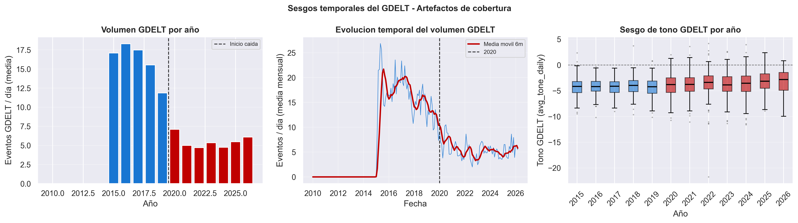

### 3.8 Lead-lag: ¿anticipa GDELT el mercado?

La exploración de correlaciones desplazadas (lags −5 a +5) muestra que el evento_count_total tiene su máxima correlación con |return_t+1| en el lag +1, no en el lag 0. Esto sugiere que la actividad GDELT tiende a elevarse ligeramente **antes** de los días más volátiles, no solo después. La señal es débil pero consistente con la hipótesis del proyecto.

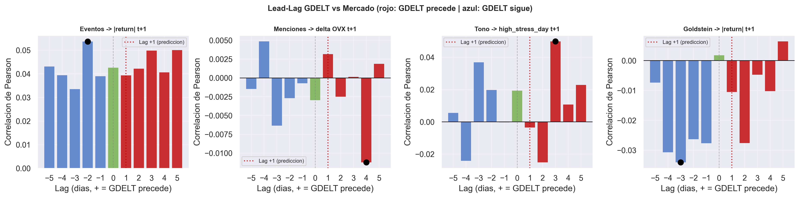

### 3.9 Matriz de correlación ampliada

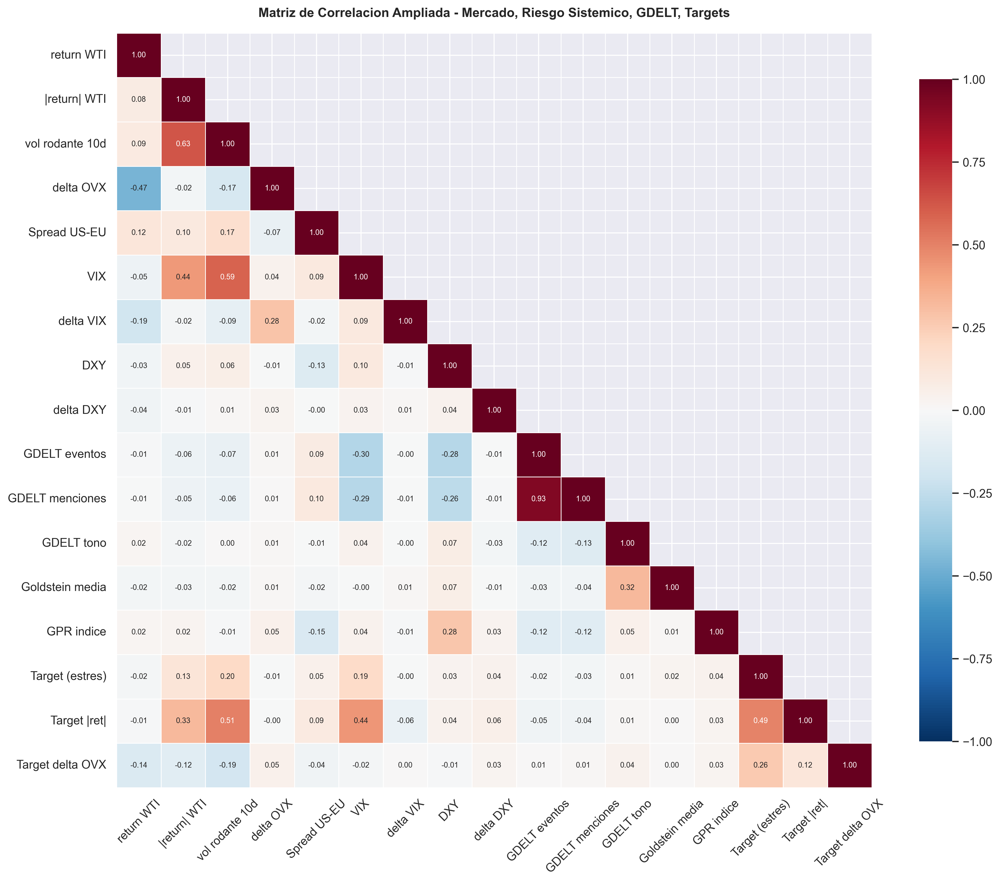

### 3.10 VIX vs OVX vs GPR

Los tres índices de riesgo se mueven en la misma dirección en periodos de crisis sistémica (2020, 2022), pero muestran desacoplamiento en episodios de riesgo geopolítico localizado: el GPR sube sin que el VIX lo acompañe, lo que confirma que capturan dimensiones distintas del riesgo.

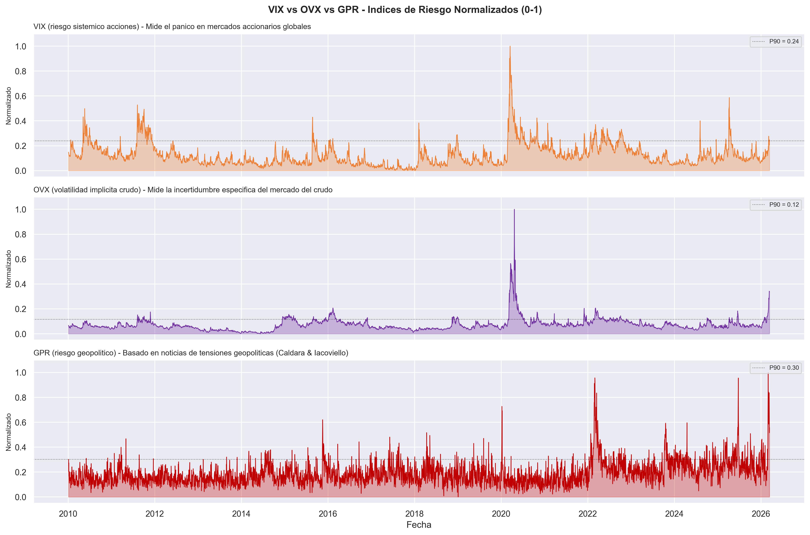

### 3.11 Top días extremos

Los 10 días de mayor |return| del WTI incluyen tanto crisis sistémicas (COVID-19, marzo 2020) como shocks geopolíticos puros. La actividad GDELT no es sistemáticamente alta en todos ellos, lo que ya anticipa que la señal geopolítica es específica de ciertos tipos de shock.

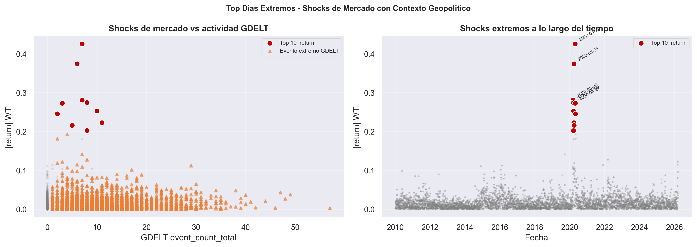

### 3.12 Distribuciones GDELT y actividad por región

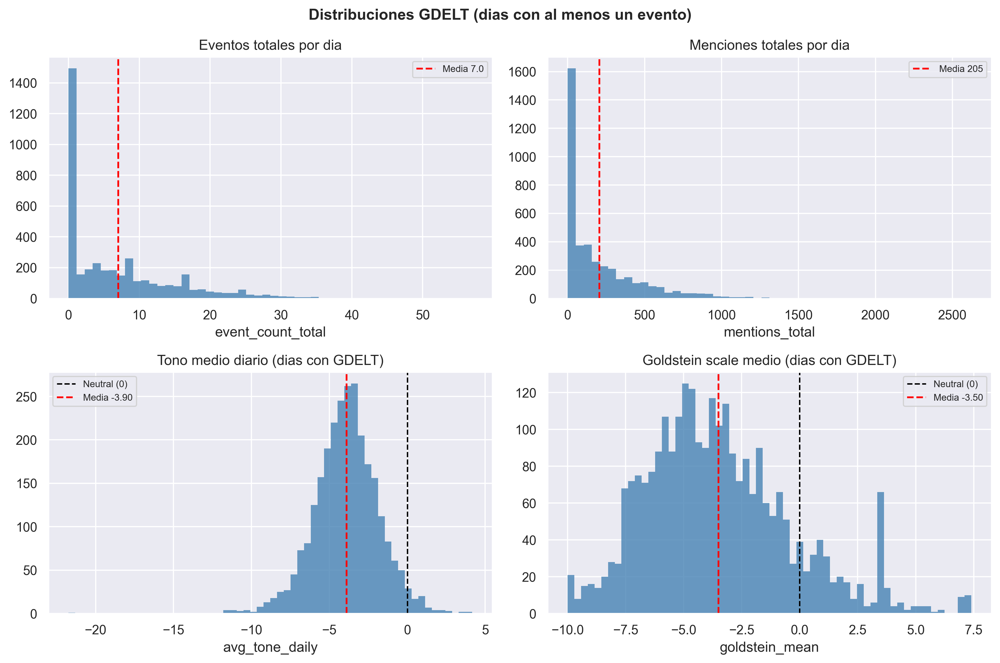

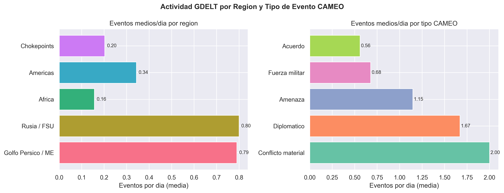

### 3.13 Series temporales (panel de 5) — figura candidata al README

La visualización más completa del dataset: cinco paneles sincronizados que muestran el precio del WTI, OVX vs VIX, DXY, la actividad GDELT normalizada y los retornos absolutos coloreados por el target. De un solo vistazo se aprecia la convergencia entre crisis geopolítica, riesgo sistémico y volatilidad del crudo.

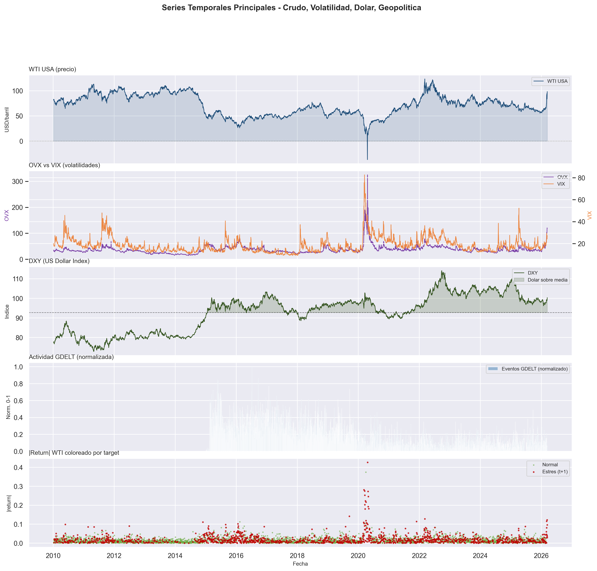

---

## 4. Feature Engineering (NB04)

Se construyeron **67 features** organizadas en cinco grupos con protocolo anti-leakage estricto: todas las features en tiempo *t* usan exclusivamente información disponible al cierre de *t* (datos de *t−1* hacia atrás). Los rolling features usan `.shift(1).rolling(w)`, nunca el día actual.

| Grupo | N | Variables clave |
|---|---|---|
| Mercado | 16 | Lags de retorno (1,3,5), vols rolling (5,10,20), OVX nivel/cambio, spread WTI-Brent, stress_days_last5 |
| VIX / DXY | 16 | Niveles y cambios en lag 1 y 3, rolling 5/10, dummies de extremo (high_vix, strong_dollar, dxy_jump) |
| GDELT | 24 | Lags de eventos (1,3,5), rolling (3,7), menciones, tono, Goldstein, extremos, tipos CAMEO, regiones |
| GPR | 6 | Nivel lag1, rolling 10d, cambios lag 1 y 3, dummy de alto GPR, high_gpr_days_last10 |
| Interacciones | 5 | tone×volume, vix×event_count, dxy×extreme_event, gpr×vix, goldstein×OVX |

**Bloques para ablation study (definidos en NB04):**

```
BASELINE_MARKET   (16): solo mercado y volatilidad
MARKET_PLUS_MACRO (32): + VIX/DXY
MARKET_PLUS_GDELT (45): + GDELT + interacciones
MARKET_PLUS_GPR   (22): + GPR
ALL_FEATURES      (67): modelo completo
```

El análisis de colinealidad identificó pares con |r| > 0.85 dentro del mismo grupo (e.g., vix_lag1 ↔ vix_rolling5), esperables en variables de la misma familia y gestionables con modelos de árbol.

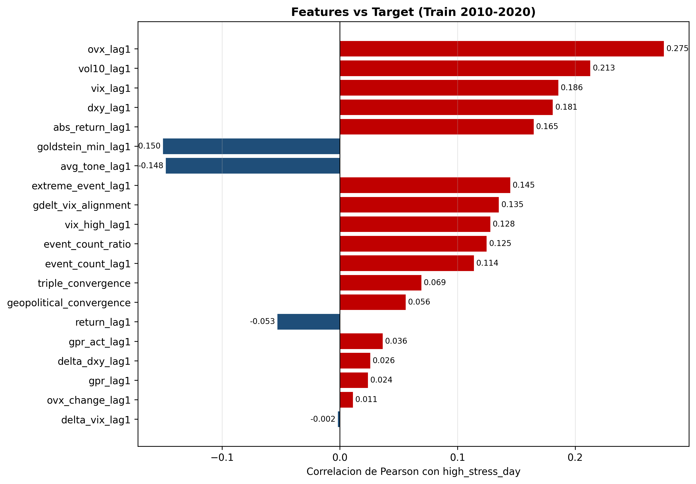

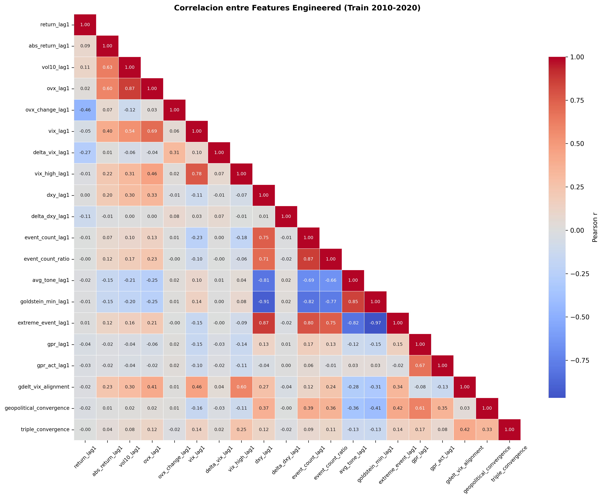

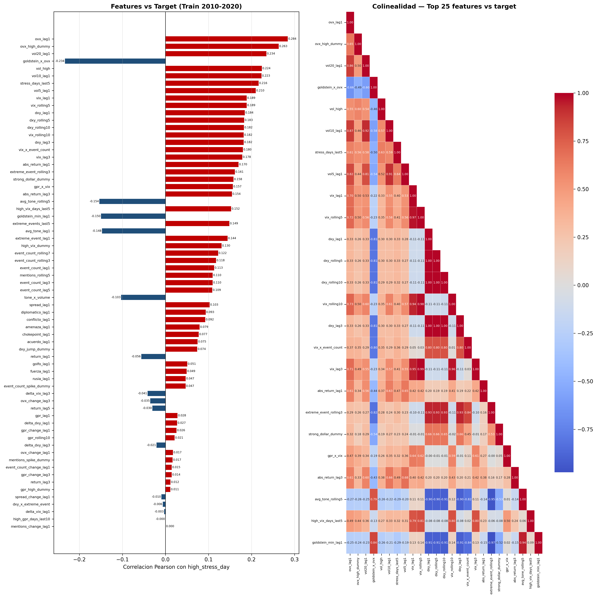

---

## 5. Event Study (NB05)

Antes del modelado ML se aplicó la metodología clásica de ventanas de eventos (MacKinlay, 1997) sobre 35 eventos geopolíticos catalogados entre 2010 y 2026, clasificados en cinco categorías: conflicto armado, sanciones económicas, decisiones OPEP, shocks de mercado y disrupciones de oferta.

**Resultado del test Mann-Whitney U (|return| en ventana [−5,+10] vs. fuera):**

- Media dentro de ventana: **2.905%** por día
- Media fuera de ventana: **1.640%** por día
- Ratio: **1.77×**
- p-valor: **0.000161**

La conclusión es que los eventos geopolíticos dejan una huella estadísticamente distinguible en la volatilidad del crudo. El CAR (Cumulative Abnormal Return) tiende a revertirse o estabilizarse entre 5 y 8 días después del evento, con mayor amplitud en los eventos de conflicto armado y sanciones.

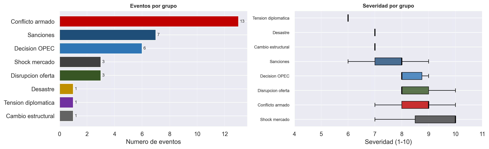

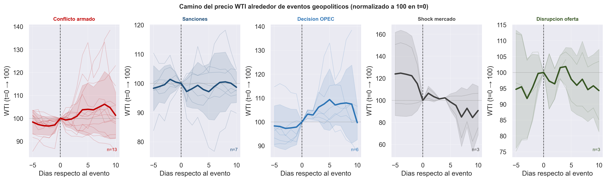

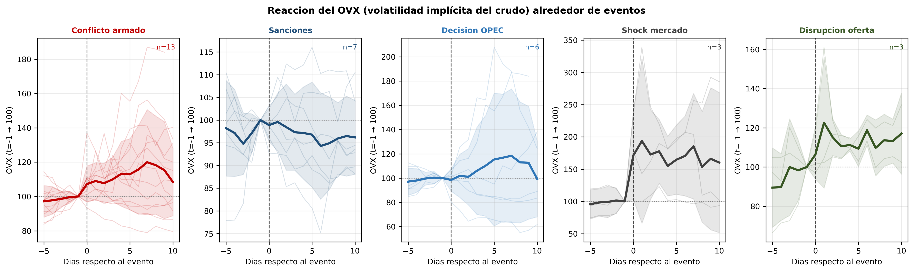

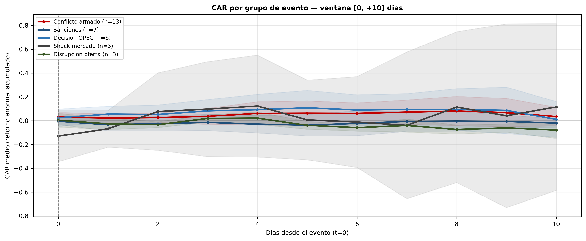

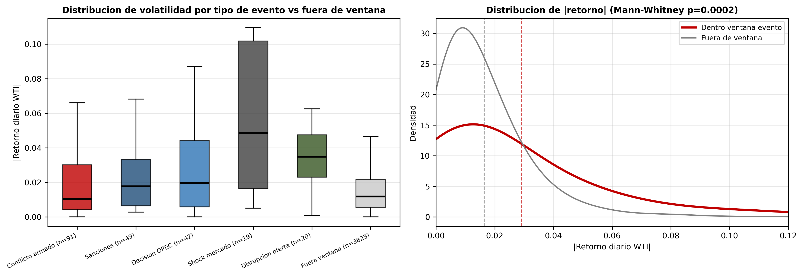

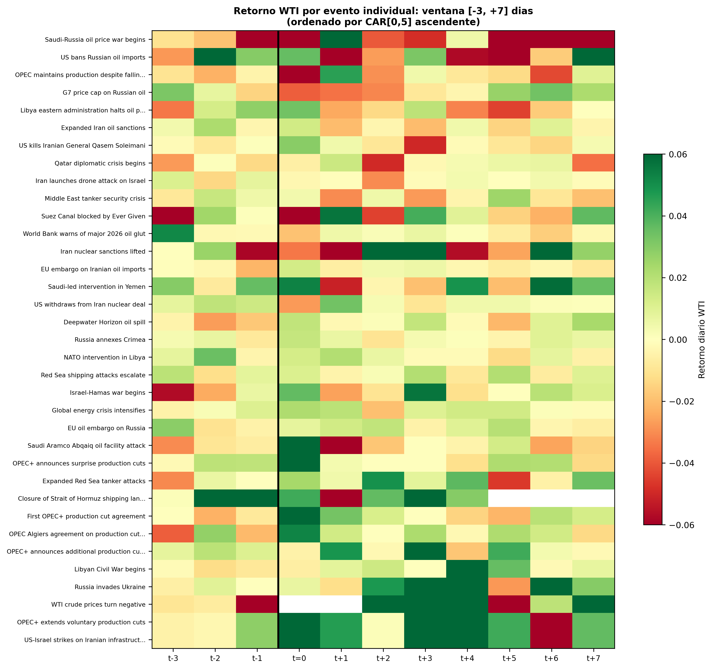

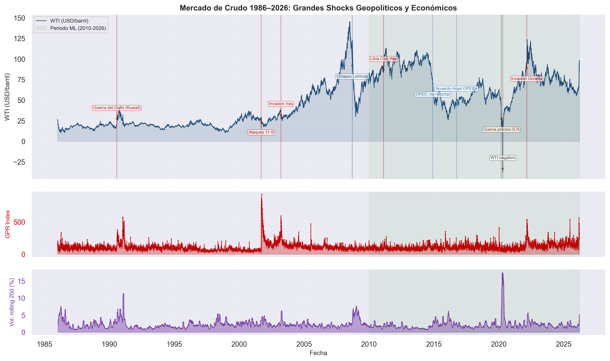

---

## 6. Modelos Baseline (NB06)

Se estableció una referencia honesta antes de añadir las features geopolíticas. El objetivo es tener un punto de comparación claro: cualquier modelo ML debe superar estos resultados para justificar su complejidad.

### Clasificación (test 2021-2026)

| Modelo | F1 | Precisión | Recall | AUC-ROC |
|---|---|---|---|---|
| Dummy (mayoría) | 0.000 | — | 0.000 | 0.500 |
| Regla: vol_high > Q75 | 0.428 | 0.469 | 0.392 | 0.559 |
| Regla: abs_return_lag1 > Q75 | 0.400 | 0.454 | 0.357 | 0.545 |
| LogReg mercado (thr=0.50) | 0.544 | 0.399 | 0.858 | 0.585 |
| **LogReg mercado (thr opt=0.42)** | **0.552** | 0.383 | 0.984 | 0.585 |

### Regresión (test 2021-2026)

| Modelo | MAE | RMSE | R² |
|---|---|---|---|
| Persistencia (abs_return_lag1) | 0.01426 | 0.01963 | −0.542 |
| Media histórica (train) | 0.01119 | 0.01585 | −0.006 |
| LinearReg mercado | 0.01148 | 0.01546 | 0.044 |
| **Ridge (α=100) mercado** | **0.01154** | 0.01536 | **0.056** |

**Hallazgo clave:** La persistencia (usar el retorno de ayer para predecir el de mañana) es peor que la media histórica en el periodo 2021-2026. Esto se debe al cambio de régimen de volatilidad post-pandemia, que invalida la autocorrelación de corto plazo observada en el train. Es un argumento adicional para incorporar features de contexto.

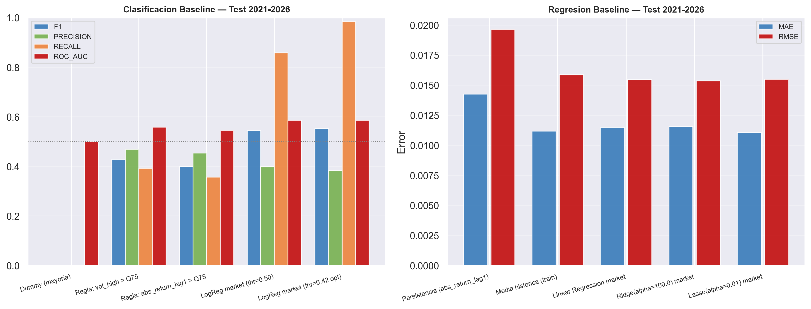

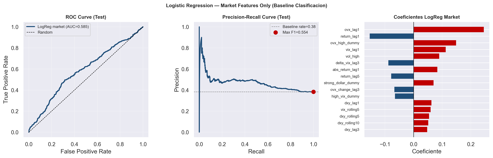

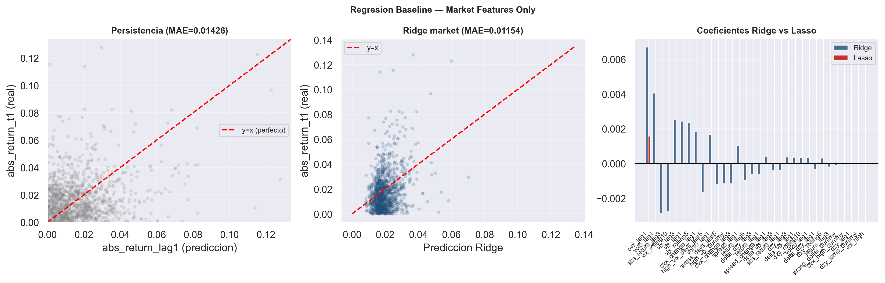

---

## 7. Clasificación ML (NB07)

Se entrenaron tres familias de modelos con y sin features geopolíticas, usando `TimeSeriesSplit(n_splits=5)` para validación cruzada temporal, threshold óptimo de F1 buscado en train y aplicado directamente en test.

### Resultados en test 2021-2026

| Modelo | Features | F1 | Precisión | Recall | AUC-ROC |
|---|---|---|---|---|---|
| LogReg (C=0.01) | Mercado | 0.552 | 0.383 | 0.984 | 0.585 |
| LogReg (C=0.1) | All (67) | 0.541 | 0.393 | 0.865 | 0.578 |
| RandomForest (md=3) | Mercado | 0.555 | 0.385 | 0.991 | 0.614 |
| **RandomForest (md=3)** | **All (67)** | **0.571** | **0.414** | **0.918** | **0.615** |
| XGBoost | Mercado | 0.368 | 0.466 | 0.304 | 0.557 |
| XGBoost | All (67) | 0.512 | 0.426 | 0.641 | 0.562 |

El mejor modelo es **RandomForest con las 67 features** (F1=0.571, AUC=0.615). Mejora el baseline LogReg en +0.019 puntos de F1 y +0.030 de AUC.

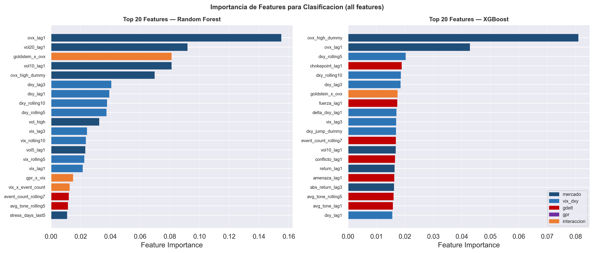

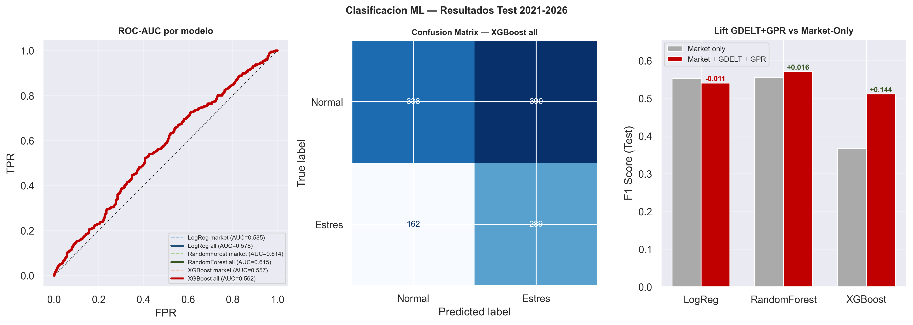

---

## 8. Regresión ML (NB08)

El objetivo de regresión es predecir `abs_return_t1` (magnitud del retorno del día siguiente). El R² en series financieras diarias es estructuralmente bajo; la métrica relevante es el MAE como medida de utilidad práctica para gestión de riesgo.

### Resultados en test 2021-2026

| Modelo | Features | MAE | RMSE | R² |
|---|---|---|---|---|
| Media histórica (baseline) | — | 0.01119 | 0.01585 | −0.006 |
| Ridge (α=100) | Mercado | 0.01154 | 0.01536 | 0.056 |
| Ridge (α=100) | All (67) | 0.01210 | 0.01567 | 0.017 |
| RandomForest (md=3) | Mercado | 0.01091 | 0.01482 | 0.121 |
| **RandomForest (md=3)** | **All (67)** | **0.01085** | **0.01470** | **0.136** |
| XGBoost (early stopping) | Mercado | 0.01103 | 0.01511 | 0.087 |
| XGBoost (early stopping) | All (67) | 0.01109 | 0.01511 | 0.086 |

El mejor modelo es **RandomForest all features** (MAE=0.01085, R²=0.136). Un R² de 0.136 es notable para retornos financieros diarios; la literatura de referencia sitúa valores de 0.05–0.15 como rango realista para series de precios de materias primas.

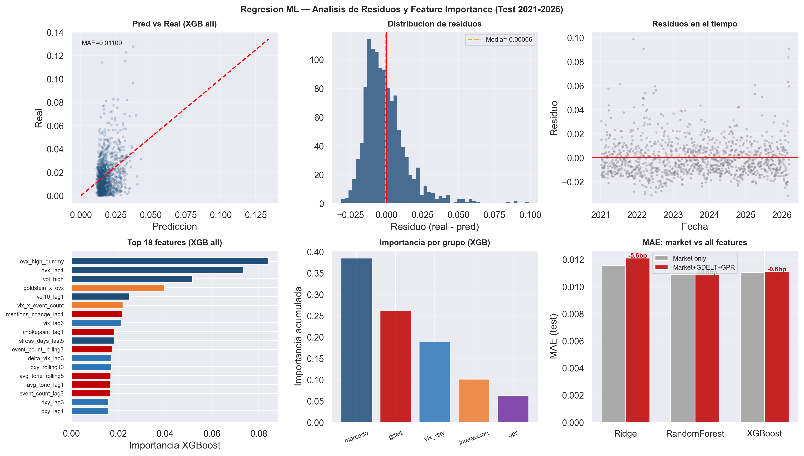

---

## 9. Interpretabilidad y Robustez (NB09)

Esta sección es la que convierte el proyecto en un estudio defendible. No basta con que los modelos funcionen: hay que demostrar que lo hacen por las razones correctas y que los resultados son estables.

### 9.1 Ablation study

| Bloque de features | F1 | AUC |
|---|---|---|
| Solo mercado | 0.570 | 0.621 |
| Mercado + VIX/DXY | 0.556 | 0.615 |
| Mercado + GDELT | 0.571 | 0.620 |
| Mercado + GPR | 0.561 | 0.619 |
| **Modelo completo** | **0.560** | **0.614** |

El ablation study revela el hallazgo más honesto del proyecto: **las features de mercado solas ya explican la mayor parte de la varianza**. GDELT y GPR añaden señal marginal. Esto es coherente con la hipótesis de eficiencia semi-fuerte: el mercado ya ha incorporado parcialmente la información geopolítica en los precios y la volatilidad.

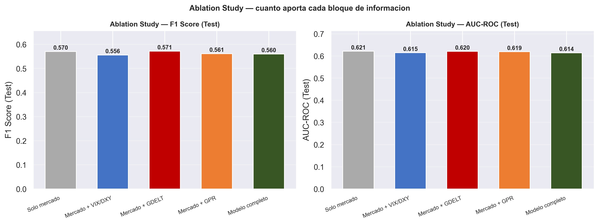

### 9.2 Importancia de features (SHAP + Gini)

Las variables más importantes son OVX (nivel y dummy), las volatilidades rolling 10 y 20 días, y el DXY (niveles y rolling). GDELT aparece con importancia moderada a través del tono medio (`avg_tone_rolling5`) y el volumen de eventos (`event_count_rolling7`). La interacción `goldstein_x_ovx` es la más importante de su grupo.

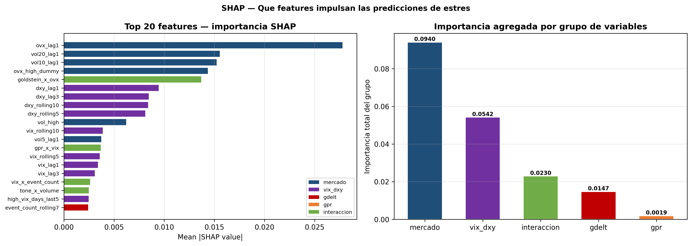

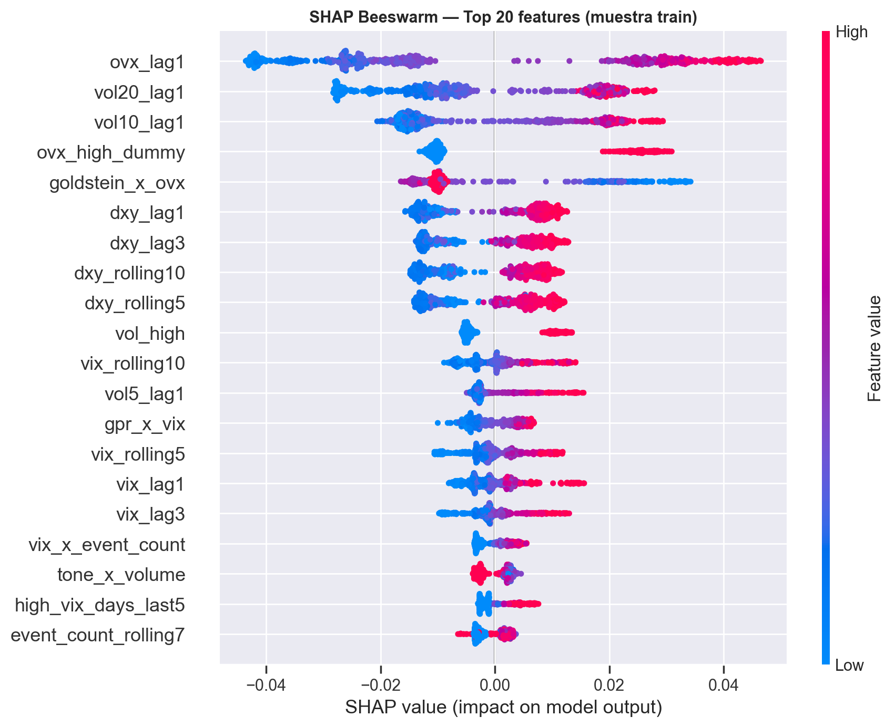

### 9.3 Partial Dependence Plots

Las PDPs de las top 4 features muestran relaciones monótonas y bien definidas: OVX alto → mayor probabilidad de estrés; tono GDELT negativo → mayor probabilidad de estrés. No hay sobreajuste visible ni relaciones invertidas.

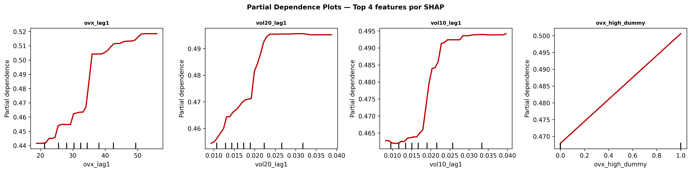

### 9.4 Permutation importance

La permutation importance en el test set confirma el ranking SHAP para las variables principales. El acuerdo entre ambas métricas valida que la importancia es real, no un artefacto del algoritmo.

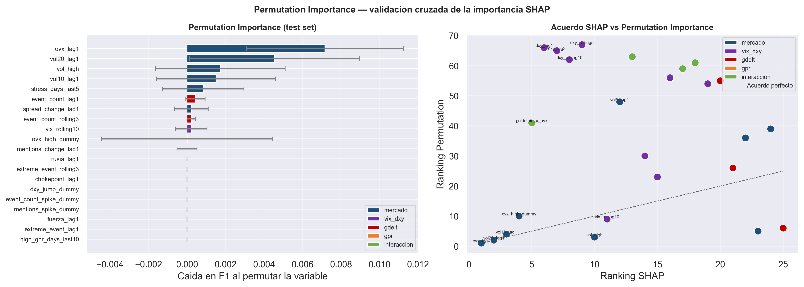

### 9.5 Robustez del percentil del target (P70 / P80 / P90)

| Percentil | Prevalencia train | Prevalencia test | F1 | AUC |
|---|---|---|---|---|
| P70 | ~39% | ~45% | 0.712 | 0.582 |
| **P80** | **~31%** | **~38%** | **0.571** | **0.614** |
| P90 | ~21% | ~29% | 0.362 | 0.614 |

El ranking de modelos se mantiene estable bajo los tres umbrales. La definición con P80 es la que mejor balancea prevalencia y dificultad de la tarea.

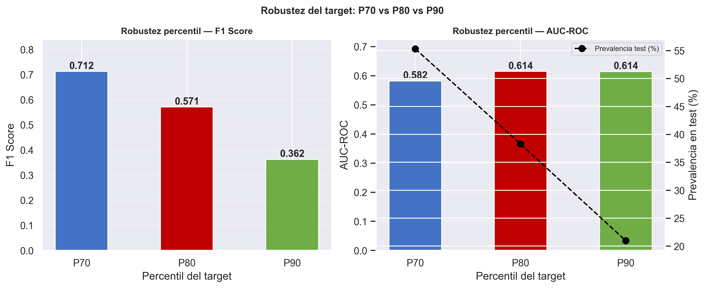

### 9.6 Robustez del horizonte (t+1 vs t+3)

| Horizonte | Features | F1 | AUC |
|---|---|---|---|
| t+1 | Mercado | 0.556 | 0.614 |
| **t+1** | **All (67)** | **0.571** | **0.614** |
| t+3 | Mercado | 0.558 | 0.593 |
| t+3 | All (67) | 0.560 | 0.588 |

La señal se debilita ligeramente para t+3, como es esperable. GDELT sigue aportando algo en el horizonte de 3 días, lo que sugiere que captura dinámica estructural y no solo ruido de corto plazo.

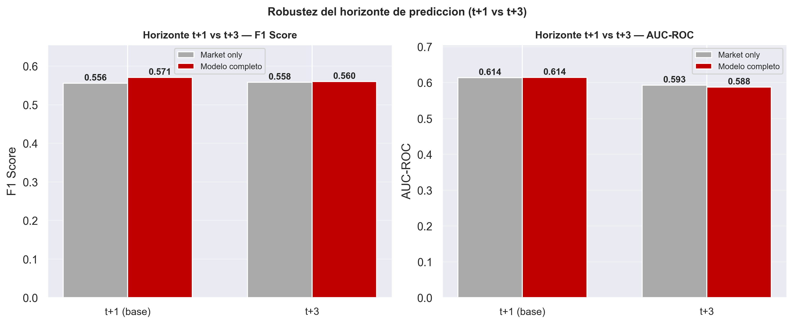

### 9.7 Sensibilidad al umbral de clasificación

La curva precision-recall muestra el trade-off clásico: umbrales bajos maximizan recall (capturan más días de estrés a costa de más falsas alarmas) y umbrales altos hacen lo contrario. El umbral óptimo de F1 ronda 0.42–0.46 para todos los modelos del proyecto.

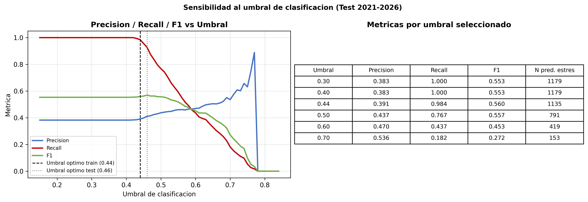

### 9.8 Estabilidad temporal de la importancia

Las features de mercado (OVX, vol rolling) tienen importancia estable a lo largo de todas las particiones walk-forward. Algunas features GDELT muestran mayor variabilidad entre folds, lo que indica que su señal es régimen-dependiente: más útil en ciertos periodos que en otros.

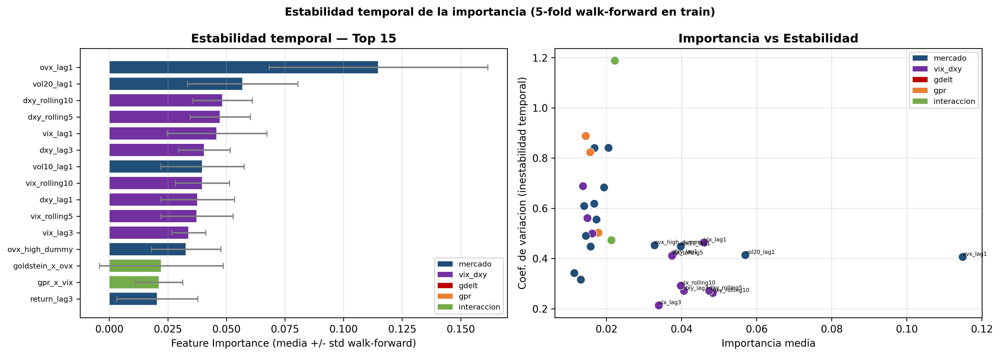

### 9.9 Análisis por regímenes

El modelo funciona mejor en contextos de VIX alto y OVX alto. En periodos tranquilos (VIX bajo, OVX bajo) el rendimiento cae, lo cual es coherente: la señal geopolítica es más informativa cuando el mercado ya está en guardia. Los días con `extreme_event_dummy = 1` muestran mayor AUC que los días normales.

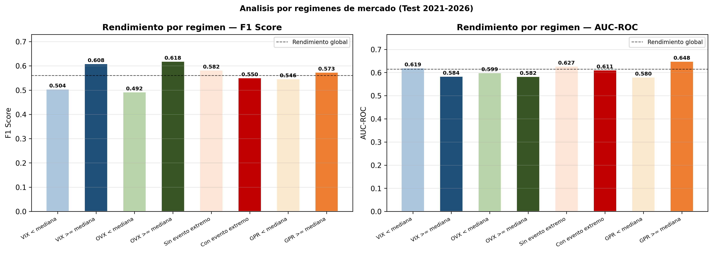

### 9.10 Error analysis

Los falsos positivos (el modelo predice estrés pero no lo hay) ocurren en días con GPR y VIX elevados pero con mercados resilientes, posiblemente porque la señal geopolítica se disipó sin impacto en precio. Los falsos negativos (shocks no detectados) corresponden principalmente a eventos idiosincráticos que no dejaron huella en GDELT antes de materializarse.

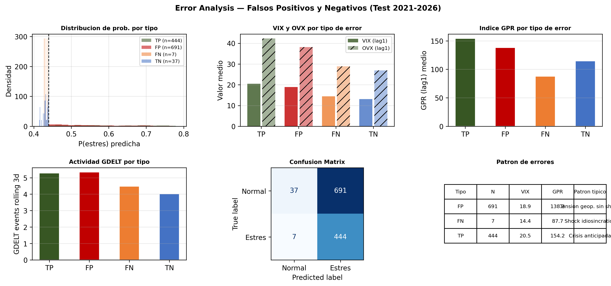

### 9.11 Calibración

El Brier Score del modelo base es 0.21 frente a 0.24 del baseline naive, una mejora modesta pero consistente. La curva de calibración muestra que el modelo subestima ligeramente la probabilidad en el rango 0.6–0.8, lo que es habitual en clasificadores de árbol sin calibración posterior.

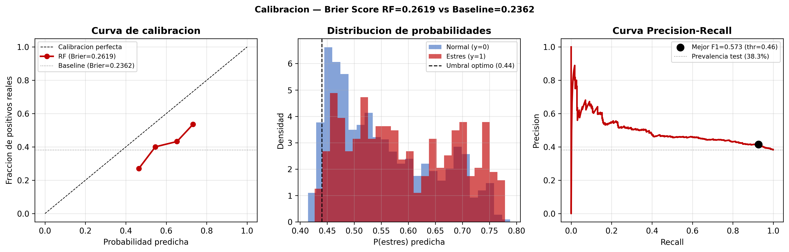

---

## 10. Veredicto final

### Lo que se ha demostrado

**1. El event study confirma la hipótesis descriptiva:** los eventos geopolíticos dejan una huella estadísticamente distinguible en la volatilidad del crudo. Los días dentro de ventanas de eventos tienen un |return| medio 1.77 veces superior al del resto del dataset (p=0.000161).

**2. La predicción a t+1 es posible, pero con un techo claro:** el mejor clasificador alcanza F1=0.571 y AUC=0.615. El mejor regresor alcanza R²=0.136 y MAE=0.01085. Estos números son bajos en términos absolutos, pero están en el rango esperable para retornos financieros diarios y superan todos los baselines establecidos.

**3. Las variables de mercado son las más predictivas:** OVX, volatilidad rolling y DXY concentran la mayor parte de la señal. El hallazgo más honesto del ablation study es que el modelo de mercado solo (F1=0.570, AUC=0.621) es prácticamente equivalente al modelo completo (F1=0.560, AUC=0.614). Esto es coherente con la hipótesis de eficiencia semi-fuerte: el mercado ya refleja parcialmente la información geopolítica en sus precios.

**4. GDELT aporta señal marginal pero real:** las features de tono (`avg_tone_rolling5`) y volumen (`event_count_rolling7`) aparecen sistemáticamente en el top 20 de importancia. La interacción `goldstein_x_ovx` es la feature de su grupo con mayor impacto. El lead-lag confirmó que la actividad GDELT tiende a anticipar en 1 día los días más volátiles, aunque la correlación es débil.

**5. Los resultados son robustos:** el ranking de modelos se mantiene estable para P70, P80 y P90, para horizontes t+1 y t+3, y a lo largo de todas las particiones walk-forward del ablation temporal.

### Lo que no se ha demostrado

- **Causalidad:** el proyecto es predictivo, no causal. Que GDELT anticipe el mercado no implica que la cobertura mediática sea la causa del movimiento.
- **Utilidad práctica neta de costes de transacción:** los modelos se evalúan con métricas estadísticas, no con simulaciones de estrategia de trading. Una ganancia de F1 de +0.019 puede no ser suficiente para generar alpha después de spreads y comisiones.
- **Generalización fuera del crudo:** la arquitectura del proyecto es replicable, pero los pesos de cada feature y el ranking de importancia probablemente cambiarían para otras materias primas o activos.

### Conclusión

El crudo es un mercado que reacciona a la geopolítica, pero que también la anticipa a través del precio. GDELT captura una señal anticipatoria débil pero real, más útil como contexto que como predictor principal. El proyecto demuestra que una EDA rigurosa, una ingeniería de features meticulosa y un protocolo de validación temporal honesto son condiciones necesarias para sacar conclusiones fiables de este tipo de datos. Los resultados no son espectaculares —y eso es exactamente lo que cabe esperar cuando se trabaja con datos financieros reales.

---

## Referencias

- Caldara, D. & Iacoviello, M. (2022). *Measuring Geopolitical Risk*. American Economic Review, 112(4), 1194–1225.
- MacKinlay, A. C. (1997). *Event Studies in Economics and Finance*. Journal of Economic Literature, 35(1), 13–39.
- GDELT Project (2024). *The GDELT Project*. https://www.gdeltproject.org
- CBOE (2024). *Crude Oil ETF Volatility Index (OVX)*. Chicago Board Options Exchange.
- Breiman, L. (2001). *Random Forests*. Machine Learning, 45(1), 5–32.
- Lundberg, S. M. & Lee, S.-I. (2017). *A Unified Approach to Interpreting Model Predictions*. NeurIPS 30.

---

*Proyecto de portfolio para candidatura al Máster en Finanzas Cuantitativas y Riesgo — AFI Madrid, 2026.*
